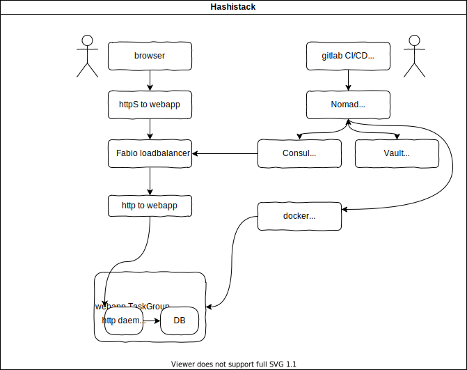
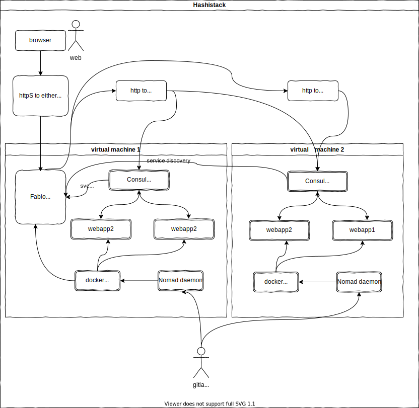

Code to create and deploy to Nomad clusters.


[[_TOC_]]


Deployment leverages a simple `.gitlab-ci.yml` using GitLab runners & CI/CD ([build] and [test]);
then switches to custom [deploy] phase to deploy docker containers into `nomad`.

This also contains demo "hi world" webapp.


Uses:
- [nomad](https://www.nomadproject.io) **deployment** (management, scheduling)
- [consul](https://www.consul.io) **networking** (service mesh, service discovery, envoy, secrets storage & replication)
- [fabio](https://fabiolb.net) **routing** (load balancing)




## Want to deploy to nomad? 🚀
- verify project's [Settings] [CI/CD] [Variables] has either Group or Project level settings for:
  - `NOMAD_ADDR` `https://MY-HOSTNAME:4646`
  - `NOMAD_TOKEN` `MY-TOKEN`
  - (archive.org admins will often have set this already for you at the group-level)
- simply make your project have this simple `.gitlab-ci.yml` in top-level dir:
```yaml
include:
  - remote: 'https://gitlab.com/internetarchive/nomad/-/raw/master/.gitlab-ci.yml'
```
- if you want a [test] phase, you can add this to the `.gitlab-ci.yml` file above:
```yaml
test:
  stage: test
  image: ${CI_REGISTRY_IMAGE}/${CI_COMMIT_REF_SLUG}:${CI_COMMIT_SHA}
  script:
    - cd /app   # or wherever in your image
    - npm test  # or whatever your test scripts/steps are
```
- [optional] you can _instead_ copy [the included file](.gitlab-ci.yml) and customize/extend it.
- [optional] you can copy this [project.nomad](project.nomad) file into your repo top level and customize/extend it if desired
- _... but there's a good chance you won't need to_ 😎

### Customizing
There are various options that can be used in conjunction with the `project.nomad` and `.gitlab-ci.yml` files, keys:
```text
NOMAD_VAR_BIND_MOUNTS
NOMAD_VAR_CHECK_PATH
NOMAD_VAR_CHECK_PROTOCOL
NOMAD_VAR_CHECK_TIMEOUT
NOMAD_VAR_COUNT
NOMAD_VAR_CPU
NOMAD_VAR_HEALTH_TIMEOUT
NOMAD_VAR_HOME
NOMAD_VAR_HOSTNAMES
NOMAD_VAR_MEMORY
NOMAD_VAR_NO_DEPLOY
NOMAD_VAR_PG
NOMAD_VAR_PORTS
NOMAD_VAR_PV
NOMAD_VAR_PV_DB
```
- See the top of [project.nomad](project.nomad)
- Our customizations always prefix with `NOMAD_VAR_`.
- You can simply insert them, with values, in your project's `.gitlab-ci.yml` file before including _our_ `.gitlab-ci.yml` like above.  Example:
```yaml
variables:
  NOMAD_VAR_NO_DEPLOY: 'true'
```

#### Custom default RAM expectations from (default) 300 MB to 1 GB
This value is the _expected_ value for your container's average running needs/usage, helpful for `nomad` scheduling purposes.  It is a "soft limit" and we use *ten times* this amount to be the amount used for a "hard limit".  If your allocated container exceeds the hard limit, the container may be restarted by `nomad` if there is memory pressure on the Virtual Machine the container is running on.
```yaml
variables:
  NOMAD_VAR_MEMORY: 1000
```
#### Custom default CPU expectations from (default) 100 MHz to 1 GHz
This value is the _expected_ value for your container's average running needs/usage, helpful for `nomad` scheduling purposes.  It is a "soft limit".  If your allocated container exceeds your specified limit, the container _may_ be restarted by `nomad` if there is CPU pressure on the Virtual Machine the container is running on.  (So far, CPU-based restarts seem very rare in practice, since most VMs tend to "fill" up from aggregate container RAM requirements first 😊)
```yaml
variables:
  NOMAD_VAR_CPU: 1000
```
#### Custom healthcheck, change from (default) HTTP to TCP:
This can be useful if your webapp serves using websockets, doesnt respond to http, or typically takes too long (or can't) respond with a `200 OK` status.  (Think of it like switching to just a `ping` on your main port your webapp listens on).
```yaml
variables:
  NOMAD_VAR_CHECK_PROTOCOL: 'tcp'
```
#### Custom healthcheck, change path from (default) `/` to `/healthcheck`:
```yaml
variables:
  NOMAD_VAR_CHECK_PATH: '/healthcheck'
```
#### Custom healthcheck run time, change from (default) `2s` (2 seconds) to `1m` (one minute)
If your healthcheck may take awhile to run & succeed, you can increase the amount of time the `consul` healthcheck allows your HTTP request to run.
```yaml
variables:
  NOMAD_VAR_CHECK_TIMEOUT: '1m'
```
#### Custom time to start healthchecking after container re/start from (default) `20s` (20 second) to `3m` (3 minutes)
If your container takes awhile, after startup, to settle before healthchecking can work reliably, you can extend the wait time for the first healthcheck to run.
```yaml
variables:
  NOMAD_VAR_HEALTH_TIMEOUT: '3m'
```
#### Custom running container count from (default) 1 to 3
You can run more than one container for increased reliability, more request processing, and more reliable uptimes (in the event of one or more Virtual Machines hosting containers having issues).

For archive.org users, we suggest instead to switch your production deploy to our alternate production cluster.

Keep in mind, you will have 2+ containers running simultaneously (_usually_, but not always, on different VMs).  So if your webapp uses any shared resources, like backends not in containers, or "persistent volumes", that you will need to think about concurrency, potentially multiple writers, etc. 😊
```yaml
variables:
  NOMAD_VAR_COUNT: 3
```
#### Custom make NFS `/home/` available in running containers, readonly
Allow your containers to see NFS `/home/` home directories, readonly.
```yaml
variables:
  NOMAD_VAR_HOME: 'ro'
```
#### Custom make NFS `/home/` available in running containers, read/write
Allow your containers to see NFS `/home/` home directories, readable and writable.  Please be highly aware of operational security in your container when using this (eg: switch your `USER` in your `Dockerfile` to another non-`root` user; use "prepared statements" with any DataBase interactions; use [https://developer.mozilla.org/en-US/docs/Web/HTTP/CSP](Content Security Policy) in all your pages to eliminate [https://developer.mozilla.org/en-US/docs/Glossary/Cross-site_scripting](XSS attacks, etc.)
```yaml
variables:
  NOMAD_VAR_HOME: 'rw'
```
#### Custom hostname for your `main` branch deploy
Your deploy will get a nice semantic hostname by default, based upon "[slugged](https://en.wikipedia.org/wiki/Clean_URL#Slug)" formula like: https://[GITLAB_GROUP]-[GITLAB_PROJECT_OR_REPO_NAME]-[BRANCH_NAME].  However, you can override this if needed.  This custom hostname will only pertain to a branch named `main` (or `master` [sic])
```yaml
variables:
  NOMAD_VAR_HOSTNAMES: '["www.example.com"]'
```
#### Custom hostnameS for your `main` branch deploy
Similar to prior example, but you can have your main deployment respond to multiple hostnames if desired.
```yaml
variables:
  NOMAD_VAR_HOSTNAMES: '["www.example.com", "store.example.com"]'
```
#### More customizations
There are even more, less common, ways to customize your deploys.

Please see the top area of [project.nomad](project.nomad) for "Persistent Volumes" (think a "disk" that survives container restarts), Postgres DB setup, additional open ports into your webapp, and more.


## Laptop access
- create `$HOME/.config/nomad` and/or get it from an admin who setup your Nomad cluster
  - @see top of [aliases](aliases)
  - `brew install nomad`
  - `source $HOME/.config/nomad`
    - better yet:
      - `git clone https://gitlab.com/internetarchive/nomad`
      - adjust next line depending on where you checked out the above repo
      - add this to your `$HOME/.bash_profile` or `$HOME/.zshrc` etc.
        - `FI=$HOME/nomad/aliases  &&  [ -e $FI ]  &&  source $FI`
  - then `nomad status` should work nicely
    -  @see [aliases](aliases) for lots of handy aliases..
- you can then also use your browser to visit [$NOMAD_ADDR/ui/jobs](https://MY-HOSTNAME:4646/ui/jobs)
  - and enter your `$NOMAD_TOKEN` in the ACL requirement


## Setup a Nomad Cluster
- [setup.sh](setup.sh)
  - you can customize the install with these environment variables:
    - `NFSHOME=1` - setup some minor config to support a r/w `/home/` and r/o `/home/`
- [setup-mac.sh](setup-mac.sh)
  - setup single-node cluster on your mac laptop

Options:
- have DNS domain you can point to a VM?
  - nomad/consul with $5/mo VM (or on-prem)
    - [[1/2] Setup GitLab, Nomad, Consul & Fabio](https://archive.org/~tracey/slides/devops/2021-03-31)
    - [[2/2] Add GitLab Runner & Setup full CI/CD pipelines](https://archive.org/~tracey/slides/devops/2021-04-07)
- have DNS domain and want on-prem GitLab?
  - nomad/consul/gitlab/runners with $20/mo VM (or on-prem)
    - [[1/2] Setup GitLab, Nomad, Consul & Fabio](https://archive.org/~tracey/slides/devops/2021-03-31)
    - [[2/2] Add GitLab Runner & Setup full CI/CD pipelines](https://archive.org/~tracey/slides/devops/2021-04-07)
- no DNS - run on mac/linux laptop?
  - [[1/3] setup GitLab & GitLab Runner on your Mac](https://archive.org/~tracey/slides/devops/2021-02-17)
  - [[2/3] setup Nomad & Consul on your Mac](https://archive.org/~tracey/slides/devops/2021-02-24)
  - [[3/3] connect: GitLab, GitLab Runner, Nomad & Consul](https://archive.org/~tracey/slides/devops/2021-03-10)


## Monitoring GUI urls (via ssh tunnelling above)

- nomad really nice overview (see `Topology` link ☝)
  - https://[NOMAD-HOST]:4646 (eg: `$NOMAD_ADDR`)
  - then enter your `$NOMAD_TOKEN`
- @see [aliases](aliases)  `nom-tunnel`
  - http://localhost:8500  # consul
  - http://localhost:9998  # fabio


## Inspect, poke around
```bash
nomad node status
nomad node status -allocs
nomad server members


nomad job run example.nomad
nomad job status
nomad job status example

nomad job deployments -t '{{(index . 0).ID}}' www-nomad
nomad job history -json www-nomad

nomad alloc logs -stderr -f $(nomad job status www-nomad |egrep -m1 '\srun\s' |cut -f1 -d' ')


# get CPU / RAM stats and allocations
nomad node status -self

nomad node status # OR pick a node's 1st column, then
nomad node status 01effcb8

# get list of all services, urls, and more, per nomad
wget -qO- --header "X-Nomad-Token: $NOMAD_TOKEN" $NOMAD_ADDR/v1/jobs |jq .
wget -qO- --header "X-Nomad-Token: $NOMAD_TOKEN" $NOMAD_ADDR/v1/job/JOB-NAME |jq .


# get list of all services and urls, per consul
consul catalog services -tags
wget -qO- 'http://127.0.0.1:8500/v1/catalog/services' |jq .
```

## Optional add-ons to your project

### Secrets
In your project/repo Settings, set CI/CD environment variables starting with `NOMAD_SECRET_`, marked `Masked` but _not_ `Protected`, eg:

and they will show up in your running container as environment variables, named with the lead `NOMAD_SECRET_` removed.  Thus, you can get `DATABASE_URL` (etc.) set in your running container - but not have it anywhere else in your docker image and not printed/shown during CI/CD pipeline phase logging.


### Persistent Volumes
Persistent Volumes (PV) are like mounted disks that get setup before your container starts and _mount_ in as a filesystem into your running container.  They are the only things that survive a running deployment update (eg: a new CI/CD pipeline), container restart, or system move to another cluster VM - hence _Persistent_.

You can use PV to store files and data - especially nice for databases or otherwise (eg: retain `/var/lib/postgresql` through restarts, etc.)

Your nomad cluster administrator has setup a series of "slots" - ask them for the next available slot for your project/repo (each project needs its own slot).

Let's say the `pv8` slot is the next free slot in the system.  Here is how you'd update your project's
`.gitlab-ci.yml` file, by adding these lines (suggest near top of your file):
```yaml
variables:
  NOMAD_VAR_PV: '{ pv8 = "/pv" }'
```
Then the dir `/pv/` will show up (blank to start with) in your running container.

If you'd like to have the mounted dir show up somewhere besides `/pv` in your container,
you can setup like:
```yaml
variables:
  NOMAD_VAR_PV: '{ pv8 = "/var/lib/postgresql" }'
```

Please verify added/updated files persist through two repo CI/CD pipelines before adding important data and files.  Your DevOps teams will try to ensure the VM that holds the data is backed up - but that does not happen by default without some extra setup.  The host VM that holds the data is the first node in the cluster from the initial cluster setup (and it all lives at `/pv/`, in numbered subdirs).


### Postgres DB
Requirements:
- set masked environment variables in your project's CI/CD Settings (see `Secrets` section above):
  - `NOMAD_SECRET_POSTGRESQL_PASSWORD`
- also, for 2nd (DB) container, set masked CI/CD var (same value as above):
  - `NOMAD_VAR_POSTGRESQL_PASSWORD`
- Your main/webapp container can find the DB IP addressd in its `Dockerfile`'s `CMD` line to setup DB access.
  NOTE: The sleep should ensure `/alloc/data/*-db.ip` file gets created by DB Task 1st healthcheck
  which the webapp Task (above) can read.
```bash
sleep 10  &&  \
echo DATABASE_URL=postgres://postgres:${POSTGRESQL_PASSWORD}@$(cat /alloc/data/*-db.ip):5432/production >| .env && \
```


## Helpful links
- https://youtube.com/watch?v=3K1bSGN7zGA 'HashiConf Digital June 2020 - Full Opening Keynote'
- https://www.nomadproject.io/docs/install/production/deployment-guide/
- https://learn.hashicorp.com/nomad/managing-jobs/configuring-tasks
- https://www.burgundywall.com/post/continuous-deployment-gitlab-and-nomad
- https://weekly-geekly.github.io/articles/453322/index.html
- https://www.haproxy.com/blog/haproxy-and-consul-with-dns-for-service-discovery/
- https://www.youtube.com/watch?v=gf43TcWjBrE  Kelsey Hightower, HashiConf 2016
- https://fabiolb.net/quickstart/

### Helpful for https / certs
- https://github.com/fabiolb/fabio/wiki/Certificate-Stores#examples
- https://developer.epages.com/blog/tech-stories/managing-lets-encrypt-certificates-in-vault/
- https://github.com/acmesh-official/acme.sh#11-issue-wildcard-certificates

### Pick your container stack / testimonials
- https://www.hashicorp.com/blog/hashicorp-joins-the-cncf/
- https://www.nomadproject.io/intro/who-uses-nomad/
  - + http://jet.com/walmart
- https://medium.com/velotio-perspectives/how-much-do-you-really-know-about-simplified-cloud-deployments-b74d33637e07
- https://blog.cloudflare.com/how-we-use-hashicorp-nomad/
- https://www.hashicorp.com/resources/ncbi-legacy-migration-hybrid-cloud-consul-nomad/
- https://thenewstack.io/fargate-grows-faster-than-kubernetes-among-aws-customers/
- https://github.com/rishidot/Decision-Makers-Guide/blob/master/Decision%20Makers%20Guide%20-%20Nomad%20Vs%20Kubernetes%20-%20Oct%202019.pdf
- https://medium.com/@trevor00/building-container-platforms-part-one-introduction-4ee2338eb11

### Future considerations?
- https://github.com/hashicorp/consul-esm  (external service monitoring for Consul)
- https://github.com/timperrett/hashpi (🍓raspberry PI mini cluster 😊)

## Issues / next steps
- have [deploy] wait for service to be up and marked healthy??
- ACME / `certmanager` for let's encrypt / https, etc.
  - basic https works now if the certs are managed independently (and passed into fabio)


## Gitlab runner issues
- *probably* just try `sudo service docker restart`
- if that still doesnt get the previously registered runner to be able to contact/talk back to the gitlab server, on box where it runs, can try:
```bash
sudo docker exec -it $(sudo docker ps |fgrep -m1 gitlab/gitlab-runner |cut -f1 -d' ') bash
gitlab-runner stop
gitlab-runner --debug run
CTC-C
gitlab-runner start
```


# Multi-node architecture



## Requirements for archive.org CI/CD:
- docker exec ✅
  - pop into deployed container and poke around - similar to `ssh`
  - @see [aliases](aliases)  `nom-ssh`
- docker cp ✅
  - hot-copy edited file into _running_ deploy (avoid full pipeline to see changes)
  - @see [aliases](aliases)  `nom-cp`
  - hook in VSCode
    [sync-rsync](https://marketplace.visualstudio.com/items?itemName=vscode-ext.sync-rsync)
    package to 'copy (into container) on save'
- secrets ✅
- load balancers ✅
- 2+ instances HPA ✅
- PV ✅
- http/2 ✅
- auto http => https ✅
- web sockets ✅
- auto-embed HSTS in https headers, similar to kubernetes ✅
  - eg: `Strict-Transport-Security: max-age=15724800; includeSubdomains`
- [workaround via deploy token] _sometimes_ `docker pull` was failing on deploy...
  - https://docs.gitlab.com/ee/user/project/deploy_tokens/index.html#gitlab-deploy-token
